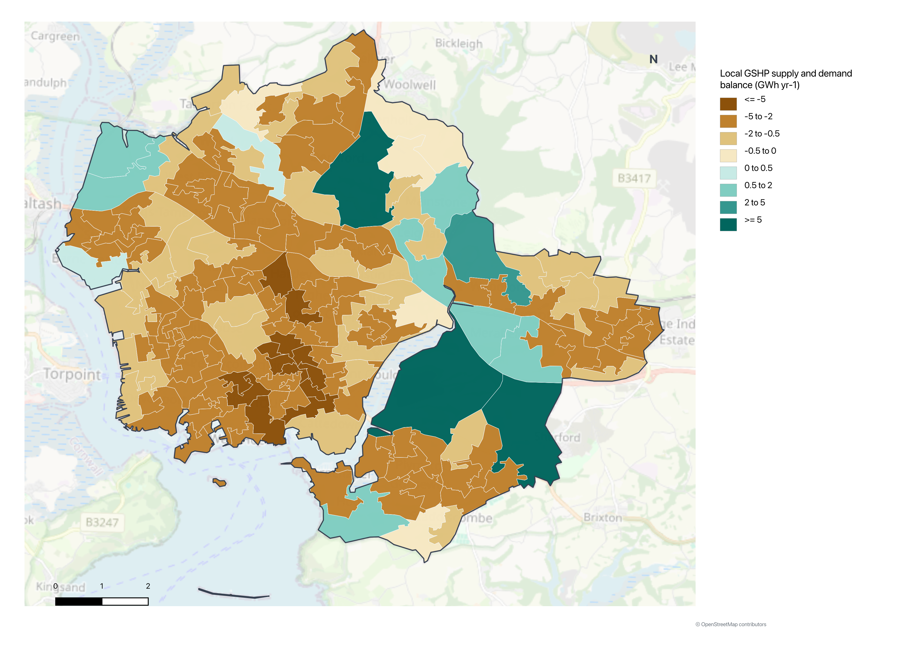
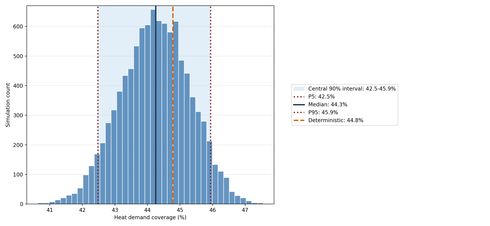

# Closed-Loop Geothermal Potential and Residential Energy Demand in Plymouth

An MSc dissertation project assessing how much of Plymouth's modelled residential energy demand could be served by closed-loop ground-source heat pumps (GSHPs). The workflow combines local energy-demand estimates, geological properties, spatial modelling and uncertainty analysis at Lower Layer Super Output Area (LSOA) level.



## Key results

- The analysis covers **164 LSOAs** and **794.9 GWh/year** of modelled residential useful heat demand.
- A representative scenario estimates **398.5 GWh/year** of GSHP potential.
- After matching supply to demand locally, GSHPs contribute **356.0 GWh/year**, equivalent to **44.8%** city-wide coverage.
- **13 LSOAs** achieve 100% local coverage in the representative scenario, while spatial mismatch leaves **438.9 GWh/year** unmet across the city.
- A **10,000-run Monte Carlo simulation** estimates median coverage of **44.3%**, with a central 90% interval of **42.5–45.9%**.
- Partial rank correlation coefficient (PRCC) analysis identifies **boiler efficiency** and **slate thermal conductivity** as the most influential model inputs.



## Research question

> How much of Plymouth's residential useful heat demand could be met by spatially matched, closed-loop geothermal energy under representative geological and engineering assumptions?

The project distinguishes theoretical city-wide supply from energy that can be matched to demand within each LSOA. This exposes the spatial imbalance between areas of relatively high geothermal potential and areas of high residential demand.

## Analytical workflow

1. Prepare Plymouth boundaries and LSOA geographies.
2. Estimate residential useful heat demand from energy-consumption and EPC data.
3. Prepare bedrock geology and assign thermal properties by lithology.
4. Generate candidate borehole heat exchanger locations on a uniform grid.
5. Estimate closed-loop geothermal supply using the G.POT method.
6. Aggregate and match geothermal supply to demand at LSOA level.
7. Test spacing, depth and borehole-resistance assumptions.
8. Quantify uncertainty with Monte Carlo simulation and PRCC sensitivity analysis.

## Data

The workflow uses data from DESNZ, domestic EPC records, ONS boundaries and lookups, British Geological Survey datasets, Ordnance Survey mapping and BRE/SAP assumptions. Raw licensed or large source datasets are not redistributed in this repository; the directory structure is retained with `.gitkeep` files to show where inputs belong.

| Data category | Expected location |
|---|---|
| ONS boundaries and lookups | `01_Data/Raw/ONS_Boundaries`, `01_Data/Raw/ONS_Lookups` |
| DESNZ energy data | `01_Data/Raw/DESNZ_Energy` |
| Domestic EPC data | `01_Data/Raw/EPC_Domestic_Plymouth` |
| BGS geology and geothermal data | `01_Data/Raw/BGS_Geology_Geothermal` |
| OS OpenMap Local | `01_Data/Raw/OS_OpenMapLocal_Digimap` |
| BRE/SAP fuel-price assumptions | `01_Data/Raw/BRE_SAP_fuel_prices` |

## Technology and methods

- **Analysis:** Python, pandas, NumPy and SciPy
- **Geospatial:** GeoPandas, Shapely, Rasterio, PyProj and QGIS
- **Modelling:** G.POT, spatial allocation and supply-demand matching
- **Uncertainty:** Monte Carlo simulation and PRCC sensitivity analysis
- **Visualisation:** Matplotlib, Seaborn, Contextily and QGIS

## Repository structure

```text
01_Data/
  Raw/          Raw input datasets
  Processed/    Cleaned and model-ready datasets

02_Code/
  LSOA_level_method/    Energy-demand and LSOA-level data-preparation notebooks
  Geothermal_model/     Geology, geothermal supply, sensitivity and uncertainty notebooks

03_Outputs/
  Figures/      Final Monte Carlo and PRCC figures
  Maps/         Final QGIS map exports
  Tables/       Final appendix tables

QGIS_PROJECT/
  geothermal_project.qgz
  derived_layers/
```

## Reproducing the analysis

The Python environment is defined in:

```text
environment.yml
```

Create and activate the environment with:

```bash
conda env create -f environment.yml
conda activate msc-dissertation-geothermal
```

The notebooks expect the source data described above to be placed in the matching `01_Data/Raw` directories. Run the notebooks in this order:

```text
02_Code/LSOA_level_method/01_boundaries.ipynb
02_Code/LSOA_level_method/02_energy_consumption.ipynb
02_Code/LSOA_level_method/03_epc_heating_system.ipynb
02_Code/LSOA_level_method/04_heat_demand_2024.ipynb

02_Code/Geothermal_model/01_Prepare_Digimap_Geology.ipynb
02_Code/Geothermal_model/02_Closed_Loop_Geothermal_Supply.ipynb
02_Code/Geothermal_model/03_Compare_Supply_With_Heat_Demand.ipynb
02_Code/Geothermal_model/04_Sensitivity_Analysis.ipynb
02_Code/Geothermal_model/05_Uncertainty_Analysis.ipynb
```

## Outputs

Final dissertation outputs are stored in:

```text
03_Outputs/Figures
03_Outputs/Maps
03_Outputs/Tables
```

The QGIS project is stored in:

```text
QGIS_PROJECT/geothermal_project.qgz
```

Key review-ready outputs include:

- [`LSOA_Supply_Demand_Results.csv`](03_Outputs/Tables/LSOA_Supply_Demand_Results.csv) — local demand, GSHP potential, matched supply, coverage and unmet demand.
- [`PRCC_Results.csv`](03_Outputs/Tables/PRCC_Results.csv) — ranked uncertainty sensitivities.
- [`Figure_4_7.png`](03_Outputs/Maps/Figure_4_7.png) — local GSHP supply-demand balance.
- [`Figure_4_8_MC_.png`](03_Outputs/Figures/Figure_4_8_MC_.png) — Monte Carlo coverage distribution.
- [`Figure_4_9_PRCC_Sensitivity.png`](03_Outputs/Figures/Figure_4_9_PRCC_Sensitivity.png) — PRCC sensitivity results.

## Interpretation and limitations

This is a strategic screening assessment, not a site-design or investment appraisal. Results depend on geological-property ranges, engineering assumptions, candidate borehole spacing and the method used to estimate residential demand. They do not by themselves establish planning feasibility, land access, installation cost or network suitability at a specific site.
